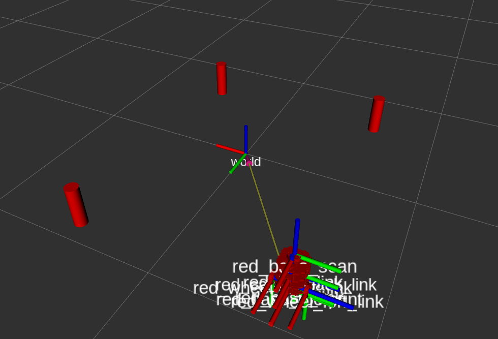

# nusim Package

## Description 
This package is a simulator and visualizer for EKF SLAM on the turtlebot3. It simulates the robot environment in rviz,  updates the simulation based on the current state information and also processes services to change the state of the world based on user input. 

## Launchfiles
One can launch the package using `roslaunch nusim nusim.launch`. The file launches 3 obstacles and a turtlebot3 robot in rviz, along with `nusim` node that provides `reset` and `teleport` services. 

Several parameters can be changed in the basic_world.yaml file: \
obs_radius: specify the radius of the obstacle \
rate: the rate of the while loop \
x0: the initial position (x) of the robot \
y0: the initial position (y) of the robot \
theta0: the initial orientation (theta) of the robot \
obstacles_x_arr: An array of the x positions of the markers \
obstacles_y_arr: An array of the y positions of the markers \
obstacles_theta_arr: An array of the theta orientations of the markers \

