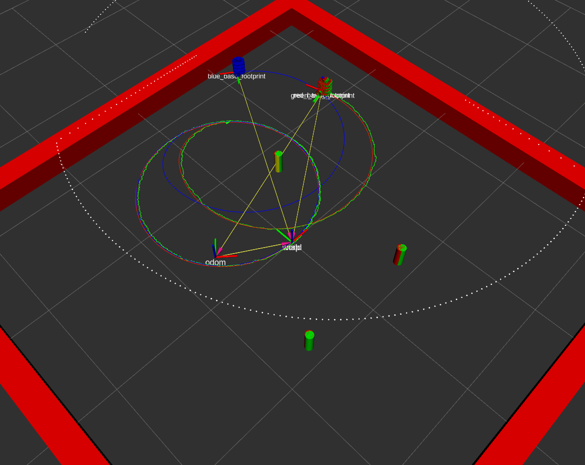

# nuslam package

## Description
This package implements an Extended Kalman Filter that measures landmarks from scanner and estimates the state of the robot. 

### Demonstration of slam in simulation

The blue robot(representing just odometry) diverges due to slip. The green robot representing the EKF state estimate is close to the actual robot (represented by red). Since noise is enabled, green robot does not follow the red robot perfectly but it stays very close to it. 

## Launchfiles 

To launch in simulation: run `roslaunch nuslam slam.launch`

By default, it loads up the circle node and allows you to drive the robot in a circle. To start the teleop node, one can run `roslaunch nuslam slam.launch cmd_src:=teleop`

## Demo with Data Association

To run with landmark detection in simulation: run `roslaunch nuslam landmark_detect.launch`

By default, it loads up the circle node, and slam, and allows you to drive the robot in a circle. To start the teleop node, one can run `roslaunch nuslam landmark_detect.launch cmd_src:=teleop`

To run on the actual robot: run `roslaunch nuslam landmark_detect.launch robot:<robot_name>`

Below are the videos for the attempt at data association with landmark detection:

### Attempted data association sim

<iframe width="560" height="315" src="https://www.youtube.com/embed/K3H-qYAfu60" title="YouTube video player" frameborder="0" allow="accelerometer; autoplay; clipboard-write; encrypted-media; gyroscope; picture-in-picture" allowfullscreen></iframe>

### Attempted Data association on real robot RVIZ

<iframe width="560" height="315" src="https://www.youtube.com/embed/eBlSOxxfLko" title="YouTube video player" frameborder="0" allow="accelerometer; autoplay; clipboard-write; encrypted-media; gyroscope; picture-in-picture" allowfullscreen></iframe>

### Attempted Data association on real robot (real robot)

https://www.youtube.com/watch?v=NDGS63yokao

<iframe width="560" height="315" src="https://www.youtube.com/embed/NDGS63yokao" title="YouTube video player" frameborder="0" allow="accelerometer; autoplay; clipboard-write; encrypted-media; gyroscope; picture-in-picture" allowfullscreen></iframe>
